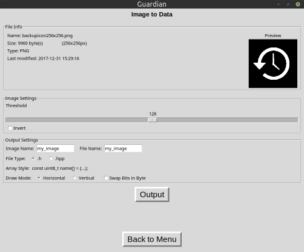
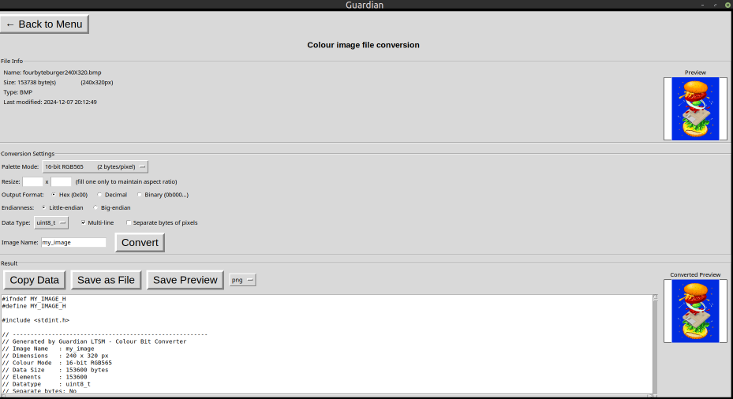

# Guardian_LTSM

[](https://gavinlyonsrepo.github.io/)  [](https://gavinlyonsrepo.github.io//feed.xml)  [](https://www.paypal.com/paypalme/whitelight976)

## Table of Contents

* [Overview](#overview)
* [Installation](#installation)
* [Libraries](#libraries)
* [Usage](#usage)
* [1-Bit Converter](#1-bit-converter)
* [Colour Converter](#colour-converter)
* [Output](#output)
* [Configuration file](#configuration-file)
* [Screenshots](#screenshots)
* [See Also](#see-also)

---

## Overview

**Guardian_LTSM** is a Python GUI tool for converting images into C/C++ byte arrays suitable for use with embedded systems, OLED displays, LCDs, and microcontroller projects.

It provides two conversion pipelines:

* **1-Bit Converter** — Convert greyscale/monochrome images to 1-bit bitmap arrays, or convert existing 1-bit C arrays back to images. Supports horizontal and vertical addressing modes as used by common OLED display drivers (e.g. SSD1306).
* **Colour Converter** — Convert colour images into raw byte arrays across multiple colour depth formats (8, 15, 16, 24, 32-bit). Supports multiple output formats and data type options suitable for colour LCD and TFT display drivers.

* GUI built with Tkinter
* Lightweight: only depends on `Pillow`
* Configurable input/output paths and preview sizes


## Installation

1. [Github repository](https://www.github.com/gavinlyonsrepo/Guardian_LTSM)
2. [Arch Linux AUR](https://aur.archlinux.org/packages/guardian)
3. [Pypi package](https://pypi.org/project/guardian-ltsm/)

The program is present in the Python Package Index, PyPI.
Install (you can use *pip* or *pipx*) to the location or environment of your choice.

```sh
# For example with pipx
pipx install guardian-ltsm
```

---

## Libraries

[Pillow](https://python-pillow.org/) for image processing

---

## Usage

0. Github repository: Guardian_LTSM
1. PyPI package name: guardian-ltsm
2. Import path: `import guardian_ltsm`
3. Executable command: `guardian`

Run the GUI:

Select from the application menu (if desktop entry installed) or run from terminal with:

```sh
guardian
# or directly with Python
python3 -m guardian_ltsm.guardian_main
```

The main menu presents two options:

* **1-Bit Converter** — opens the 1-bit image/data conversion tool
* **Colour Converter** — opens the colour image conversion tool

---

## 1-Bit Converter

The 1-bit converter has two paths selectable from the main menu:

### Image to Data

1. Load a PNG, BMP, JPG, or GIF image
2. Adjust image settings:
   * **Threshold** — slider (0–255) controls the greyscale cutoff for black/white conversion
   * **Invert** — invert the bitmap
3. Adjust output settings:
   * **Image Name** — variable name used in the C array declaration
   * **File Name** — output file name
   * **File Type** — `.h` or `.hpp`
   * **Draw Mode** — Horizontal or Vertical addressing
   * **Swap Bits in Byte** — mirror bit order within each byte
4. Click **Output** to save the header file. Data is also copied to clipboard automatically.

### Data to Image

1. Paste a raw C byte array (0x00 format) into the dialog
2. Enter image width and height in pixels
3. Select addressing mode (Horizontal or Vertical)
4. Click **Convert to Image** — the image is rendered in the preview
5. Click **Output** to save as PNG or BMP

Example output:

```c
// Generated by Guardian LTSM - One Bit Converter
// Image Name  : my_image
// Dimensions  : 84 x 24 px
// Data Size   : 252 bytes
// Draw Mode   : Vertical
// Swap Bits   : No
// Threshold   : 128
// Inverted    : No
const uint8_t my_image[] = {
    0xFF, 0x00, 0x1C, 0x22, 0x22, 0x1C, 0x00, 0xFF, ...
};
```

---

## Colour Converter

1. Load a PNG, BMP, JPG, or GIF image — file info and preview are displayed
2. Adjust conversion settings:

| Setting | Description |
| ------- | ----------- |
| Palette Mode | Colour depth and format of the output data |
| Resize | Optional resize before conversion. Fill one field only to maintain aspect ratio |
| Output Format | Hex (0x00), Decimal, or Binary (0b00000000) |
| Endianness | Little-endian or Big-endian byte order (affects 16-bit modes) |
| Data Type | Array element type:  `uint8_t`, `uint16_t`, `uint32_t` |
| Multi-line | One row of pixels per line in the output array |
| Separate bytes | Each byte is its own array element. When off, bytes are packed into elements matching the data type size |
| Image Name | Variable name used in the C array declaration |

3. Click **Convert** — data appears in the result panel and a converted preview is shown
4. Use the output buttons to copy or save the result

### Supported Palette Modes

| Mode | Bits per pixel | Bytes per pixel |
| ---- | -------------- | --------------- |
| 8-bit Greyscale | 8 | 1 |
| 8-bit RGB332 | 8 | 1 |
| 15-bit RGBA555 | 15 | 2 |
| 16-bit RGB565 | 16 | 2 |
| 16-bit BGR565 | 16 | 2 |
| 24-bit RGB | 24 | 3 |
| 32-bit RGBA | 32 | 4 |

### Separate Bytes Example (RGBA, uint32_t)

**Separate bytes OFF:**
```c
const uint32_t my_image[] = {
    0xFF0000FF, 0xFF0000FF, ...
};
```

**Separate bytes ON:**
```c
const uint32_t my_image[] = {
    0xFF, 0x00, 0x00, 0xFF, 0xFF, 0x00, 0x00, 0xFF, ...
};
```

---

## Output

The 1-bit converter saves `.h` or `.hpp` header files containing a C array and a comment block with all conversion parameters.

The colour converter saves `.h`, `.hpp`, `.c`, or `.txt` files. A preview image can also be saved as PNG, BMP, or JPG.

Both tools copy output data to the clipboard automatically on save for quick pasting into an IDE.

---

## Configuration file

The configuration file is created on startup and populated with default values.
The file is located at `~/.config/guardian_ltsm/guardian_ltsm.cfg` on Linux systems.

| Section | Setting | Type | Default | Note |
| ------- | ------- | ---- | ------- | ---- |
| Paths | input_dir | string | home directory | Default directory for open file dialogs |
| Paths | output_dir | string | home directory | Default directory for save file dialogs |
| Display | preview_width | int | 160 | Width of image preview boxes in pixels |
| Display | preview_height | int | 160 | Height of image preview boxes in pixels |
| Display | screen_resolution | string | 1000x800 | Size of the main application window on start up |
| Debug | debugOnOff | bool | 0 | Enable debug output to terminal |

---

## Screenshots

1-Bit Converter — Image to Data



Colour Converter



---

## See Also

**[Colossus_LTSM](https://github.com/gavinlyonsrepo/Colossus_LTSM)** — Sister project. Converts TrueType fonts (`.ttf`) into C/C++ bitmap arrays and visualizes font data stored in C/C++ header files. Aimed at the same embedded systems audience.
